# 💧 DropWise AI

DropWise AI is an AI-powered web platform designed to promote water conservation and help users manage freshwater resources efficiently. Built for a hackathon, it combines AI-driven insights with interactive tools to raise awareness and encourage sustainable water usage.

## 🚀 Features
- AI Water Availability Predictor
- Water Usage Tracker
- Water Saving Tips
- Interactive Dashboard
- Responsive UI
- Modern React + Vite Interface

## 🛠️ Tech Stack
- React
- TypeScript
- Vite
- Tailwind CSS
- Replit

## 👥 Team
- Audarya Karekar
- Harshita Hundre
- Soham Sapkal

## 🌐 Live Demo
(Add your Vercel link after deployment)

# 📌 DropWise AI

## 📸 Application Screenshots

### 🏠 Home Page (Version 1)

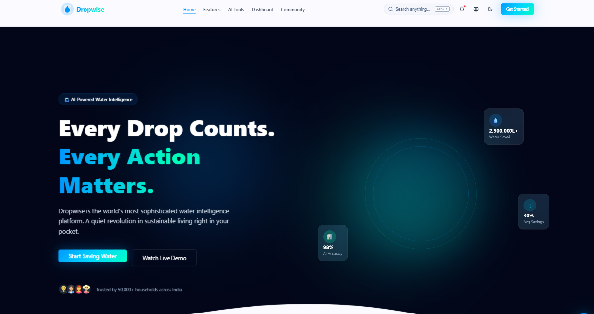

---

### 🏠 Home Page (Version 2)

---

### 🌊 Smart Water Management Features

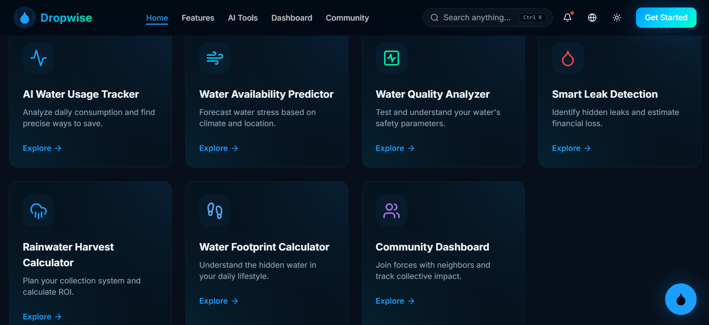

**Includes:**
- 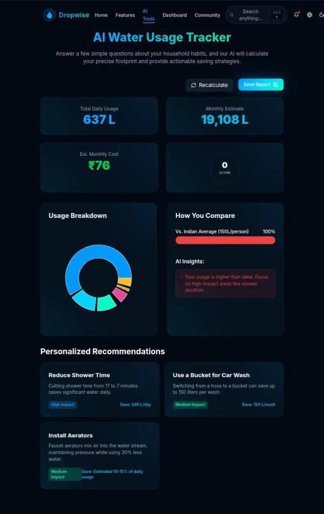
- 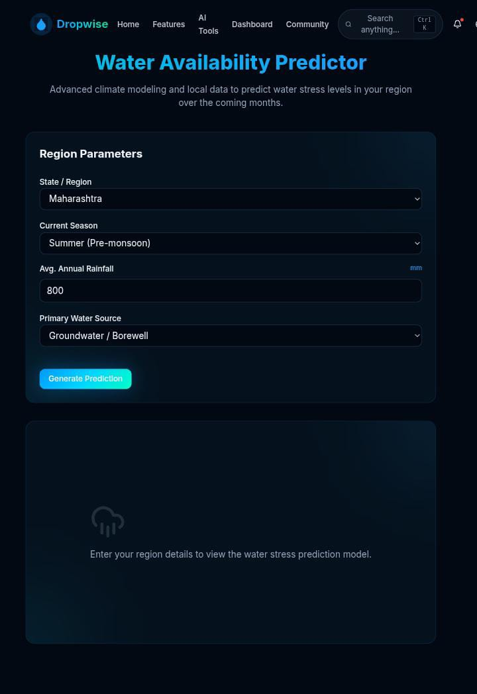
- 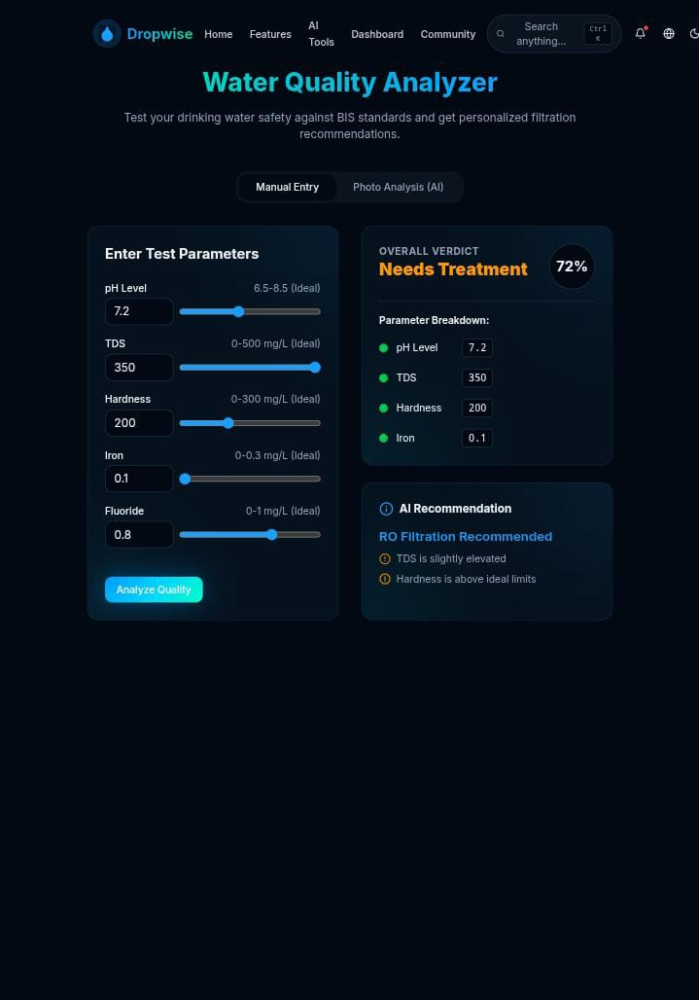
- 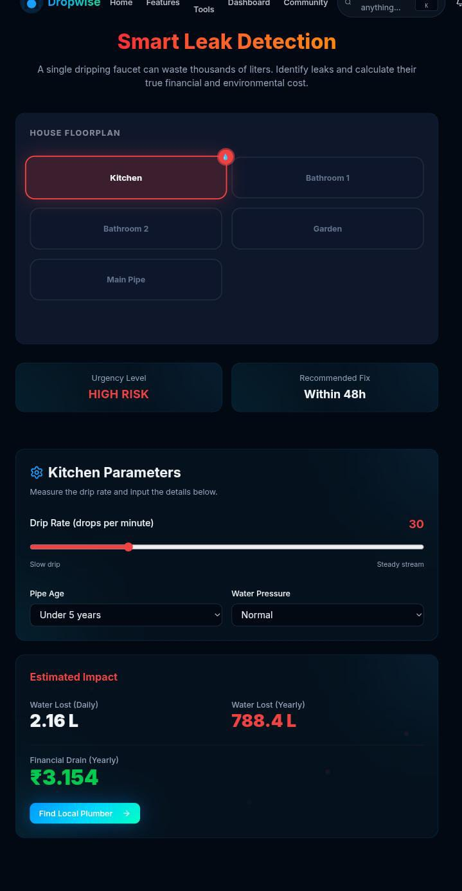
- 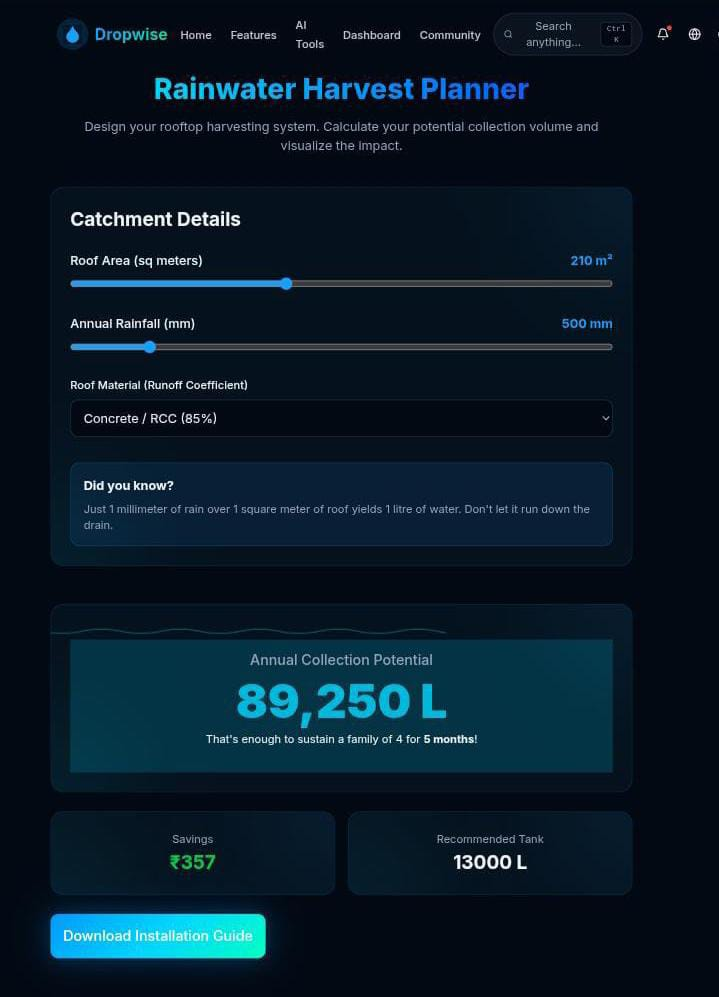
- 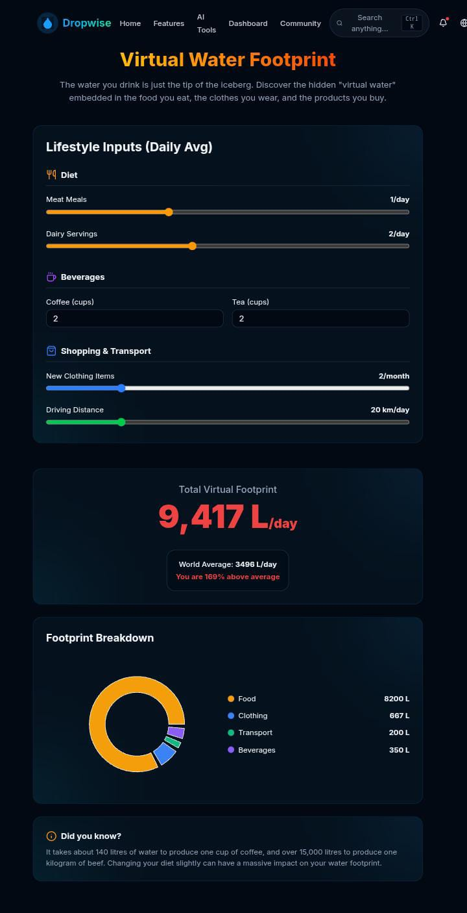
- Community Dashboard
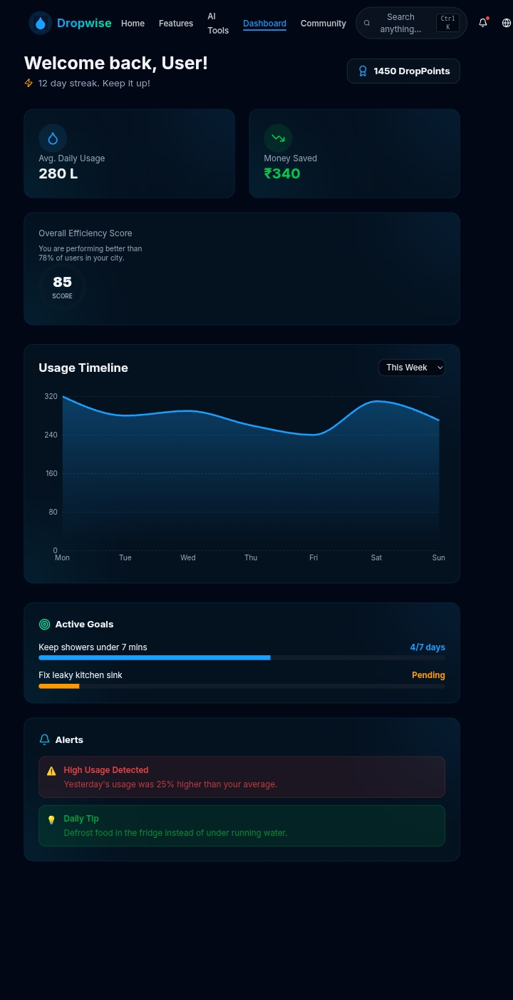
---

### 🤖 DropWise AI Assistant

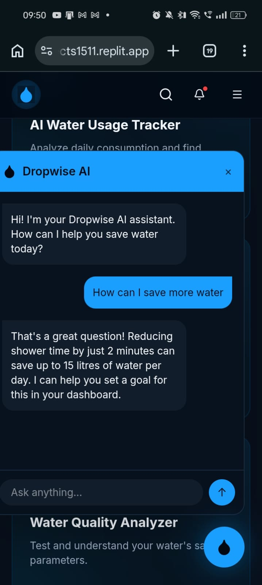

AI-powered assistant that provides personalized water-saving tips, answers user queries, and recommends sustainable water management practices.

---

Monitor:
- Water Consumption
- Water Savings
- Usage Analytics
- Community Impact
- Personal Statistics

---

### 🌙 Dark Mode

Switch between Light and Dark themes for a comfortable user experience.

---

### 🔔 Notification Center

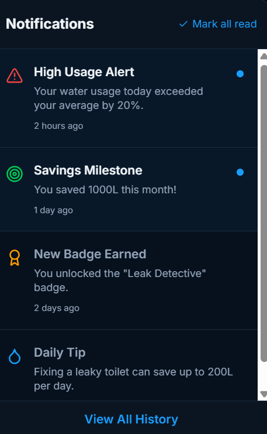
Stay updated with:
- Water-saving reminders
- Leak alerts
- AI recommendations
- Community updates

---

### 🌐 Multi-Language Support
-> English
-> Hindi 
-> Marathi 
-> Tamil

Supports multiple languages for wider accessibility.

---

## 🚀 Key Features

- 💧 AI Water Usage Tracker
- 📈 Water Availability Predictor
- 🧪 Water Quality Analyzer
- 🚰 Smart Leak Detection
- 🌧️ Rainwater Harvest Calculator
- 👣 Water Footprint Calculator
- 🤖 AI Assistant
- 📊 Interactive Dashboard
- 🌙 Dark Mode
- 🔔 Notification System
- 🌐 Multi-language Support
- 📱 Fully Responsive Design

## 📄 License
MIT
